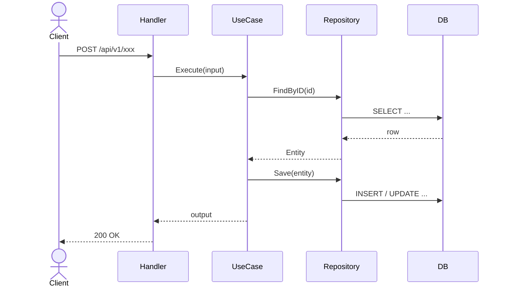
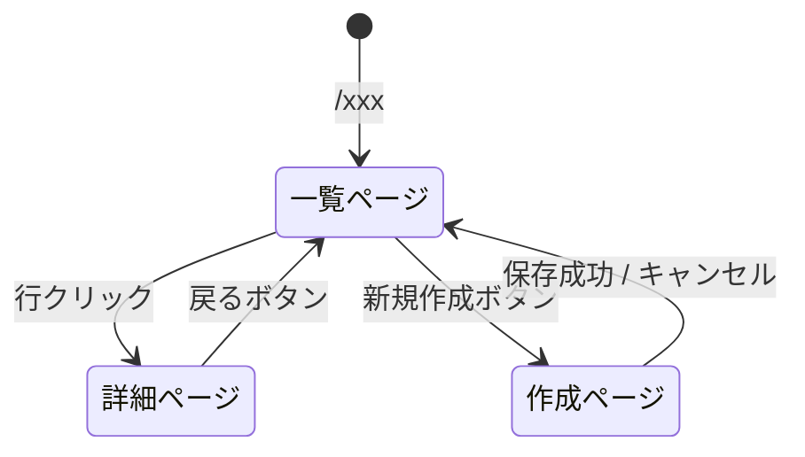

# 実装設計書テンプレート

`/design-plan` スキルで使用する実装設計書のテンプレート。
Issueの内容・対象の層に応じて不要なセクションは省略してよい。

---

## 実装設計書: <Issue タイトル>

### 概要
<このIssueで実現する機能・変更の1〜3文サマリー>

### 設計方針
<主要な設計上の判断と、その理由を箇条書きで>
- 例: Aggregate RootをXXXとする理由
- 例: Clean Architectureのどの層に何を配置するか

---

### アーキテクチャ

#### ドメイン層 (`go-backend/internal/domain/`)

| 対象 | 変更種別 | 内容 |
|------|----------|------|
| エンティティ名 | 新規 / 変更 / 変更なし | 変更の概要 |

**モデリングの意図:**
<このドメインモデルをこう設計した理由。集約境界・不変条件・ライフサイクルの考え方など>
- 例: `Order` を Aggregate Root とし、`OrderItem` を内包する理由（整合性を Order 単位で保つため）
- 例: `Status` を値オブジェクトにする理由（状態遷移ルールをドメイン層で表現するため）

**新規/変更するドメインモデル（シグネチャレベル）:**
```go
type Foo struct {
    ID   FooID
    Name string
}
```

**DBスキーマ (`go-backend/db/`):**
```sql
-- ドメインモデルと対応するテーブル定義・マイグレーション
-- 変更がない場合はこのブロックを省略
ALTER TABLE xxx ADD COLUMN yyy TEXT NOT NULL;
```

#### ユースケース層 (`go-backend/internal/usecase/`)

| ユースケース | 変更種別 | 説明 |
|-------------|----------|------|
| XxxUseCase | 新規 / 変更 | 何をするか |

**処理フロー:**


**インターフェース定義:**
```go
// 追加・変更するユースケースのメソッドシグネチャ
```

#### インターフェース層 (`go-backend/internal/interface/`)

| エンドポイント | メソッド | 説明 | 認証 |
|--------------|---------|------|------|
| /api/v1/xxx  | GET / POST / PUT / DELETE | 何をするか | 要 / 不要 |

**リクエスト/レスポンス定義:**
```json
// POST /api/v1/xxx
// Request
{
  "field": "value"
}

// Response 200
{
  "id": "uuid",
  "field": "value"
}
```

#### フロントエンド (`react-frontend/`)

**ページ一覧:**

| パス | ページ名 | 説明 |
|------|---------|------|
| `/xxx` | Xxx一覧 | 何ができるページか |
| `/xxx/:id` | Xxx詳細 | 何ができるページか |

**ページ遷移:**


**各ページの機能:**

- **一覧ページ (`/xxx`)**
  - [ ] <できること1>
  - [ ] <できること2>

- **詳細ページ (`/xxx/:id`)**
  - [ ] <できること1>
  - [ ] <できること2>

#### インフラ層 (`go-backend/internal/infrastructure/`)

| 対象 | 変更種別 | 内容 |
|------|----------|------|
| XxxRepository | 新規 / 変更 | 変更の概要 |

---

### エラーハンドリング

| エラーケース | HTTPステータス | エラーコード | 対応方法 |
|-------------|--------------|------------|---------|
| <ケース> | 400 / 404 / 500 等 | <コード> | <対応> |

---

### テスト方針

| テスト種別 | 対象 | テストシナリオ |
|-----------|------|--------------|
| ユニットテスト | ドメイン層 | 正常系・異常系・バリデーション |
| 統合テスト | リポジトリ層 | DB操作の正確性 |
| E2Eテスト | APIエンドポイント | ユーザーシナリオ全体 |

---

### 実装順序

依存関係に従い、下位層から上位層の順に実装する。

1. [ ] ドメイン層 + DBマイグレーション: <具体的なタスク>
2. [ ] インフラ層（Repository実装）: <具体的なタスク>
3. [ ] ユースケース層: <具体的なタスク>
4. [ ] インターフェース層: <具体的なタスク>

---

### 影響範囲

- 変更によって影響を受ける既存機能・API
- 破壊的変更の有無（ある場合は `docs/operations` への記載が必要）
- 依存するチーム・システムへの影響

---

### 受入テスト項目

実装完了後にユーザー視点で確認する項目。UT/IT/E2E とは別に、「この機能が正しく動いている」と判断できる手動確認のチェックリスト。

- [ ] <シナリオ1: 例）新規作成フォームで必須項目を入力して送信すると、一覧に追加されて表示される>
- [ ] <シナリオ2: 例）不正な値を入力した場合、エラーメッセージが表示されて送信できない>
- [ ] <シナリオ3: 例）権限のないユーザーがアクセスすると 403 が返る>

---

### 未解決事項

- [ ] <判断が必要な事項1>
- [ ] <判断が必要な事項2>
